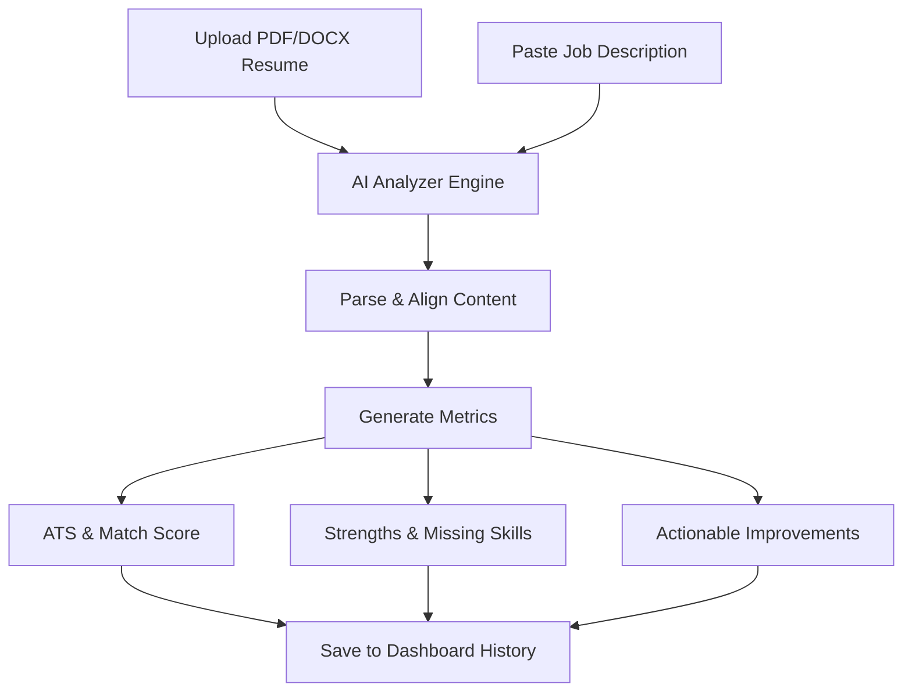

# AI Resume Analyzer 📄🚀

AI Resume Analyzer is a next-generation resume optimization platform that empowers candidates to decode applicant tracking systems (ATS), discover community-driven growth opportunities, and align their career profiles with modern job requirements.

---

## 🔭 Vision

To democratize the career development process by transforming static resumes into dynamic, AI-optimized profiles, leveling the playing field for job seekers worldwide, and matching talent with their dream teams.

---

## 💡 Why AI Resume Analyzer?

Over **75% of resumes** are filtered out by automated Applicant Tracking Systems (ATS) before they ever reach a human recruiter. Standard job applications feel like throwing resumes into a black hole.
AI Resume Analyzer bridges this gap by:
- Demystifying ATS algorithms to show you exactly how systems parse your profile.
- Providing immediate, objective match scoring against specific job descriptions.
- Eliminating guesswork by pointing out missing critical skills and keywords.

---

## 🌟 Features

- **Multi-Format Parsing**: Directly extracts and processes text from **PDF** and **DOCX** files.
- **Precision Keyword Mapping**: Identifies exact tech stack mismatches and industry-specific keywords.
- **Actionable AI Feedback**: Translates raw match rates into clear suggestions for resume headers, experience logs, and skill listings.
- **History Logs**: Easily tracks past revisions and match rates to monitor your optimization progression.
- **Zero-DB Setup**: Features an automated in-memory MongoDB fallback database (`mongodb-memory-server`) for instant local setups.

---

## 🤝 The Community Ecosystem

Optimize your resume, grow with peers, and level up together. AI Resume Analyzer includes conceptual frameworks to build community-driven career paths:

### 🎯 Find Your Tribe
Don't navigate the job search alone. Find your tribe based on roles, industries, or technology targets. Join cohorts of fellow Frontend Engineers, Product Managers, or Data Scientists to share interview prep questions, referral channels, and learning goals.

### 🛡️ Communities & Clans
Form specialized clans to run resume-review circles, peer mock interviews, and collaborative hackathons. Clans foster accountability, peer mentorship, and shared knowledge bases for target companies.

### 🏆 Leagues
Gamify your job search. Compete in weekly leagues based on profile optimization milestones, skill verification badges, mock interview points, and community contributions. Rise through the ranks from Bronze to Legend.

---

## 💼 Opportunity Network

The Opportunity Network turns your optimized profile into an active magnet for recruiters. 
- **Recruiter Sourcing**: Recruiters can filter and find verified candidate matches who have high job-match scores.
- **Skills Verification**: Show off badges and scores earned through coding challenges and portfolio projects.
- **Passive Recruitment**: Let companies discover your optimized resume and reach out to you directly for relevant openings.

---

## 🛠️ How It Works

1. **Upload & Input**: Upload your resume file (PDF/DOCX) and paste the description of the job you want to target.
2. **AI Analysis**: Our AI engine parses the resume content, maps it against the job description requirements, and evaluates it against standard ATS parsing patterns.
3. **Review & Iterate**: Get your scores, missing keywords, and suggestions, then adjust your resume and re-upload to watch your match score rise.

---

## 💻 Tech Stack

- **Frontend**: React.js (Vite), Tailwind CSS, React Router, Lucide Icons, Axios.
- **Backend**: Node.js, Express, Mongoose, `@google/generative-ai` SDK (Gemini API), Multer (file handling).
- **Parsers**: `pdf-parse` & `mammoth` (Word document reader).
- **Database**: MongoDB (via `mongodb-memory-server` in local dev).

---

## 🚀 Installation & Running Locally

Refer to our quickstart guide inside the [installation section](#installation) of our documentation to clone the repo, setup your `.env` variables, and run `npm run dev` in both the frontend and backend directories.
